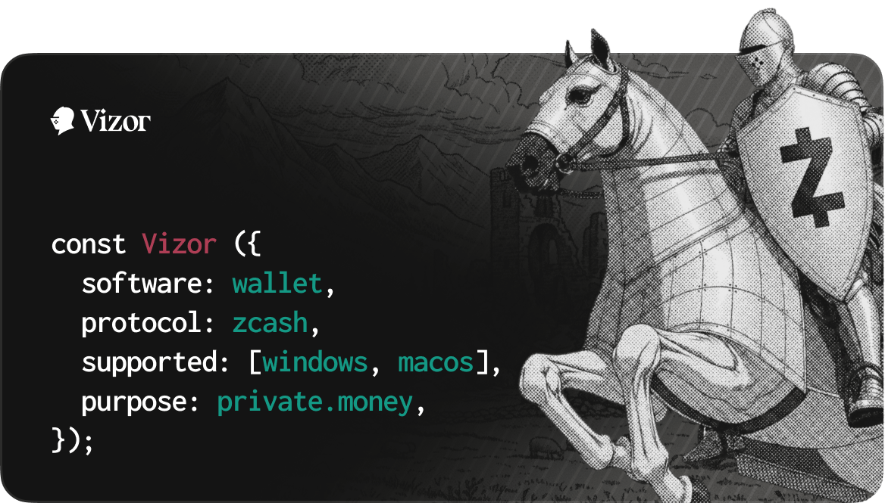

# Vizor

Vizor is a self-custody Zcash wallet for shielded ZEC, with a polished desktop
experience built around clarity, privacy, and ease of use. It is for users who
want to create, receive, shield, and send ZEC without giving a hosted wallet
service control over their funds.

Official public releases currently focus on signed and notarized macOS DMGs.

## Features

- Create or import a Zcash wallet.
- Use a clean, modern interface designed to make shielded Zcash easier to use.
- Receive to shielded Unified Addresses or transparent addresses.
- Send ZEC from shielded balance.
- Add memos when sending to shielded recipients.
- Shield funds received to a transparent address.
- Use multiple accounts in one wallet.
- Import Keystone hardware wallet accounts.
- Choose from preset or custom lightwalletd endpoints.
- View balances, sync progress, and transaction history in a focused desktop
  UI.
- Protect local access with an app password and privacy mode.

## Build From Source

Use the release tag that matches the DMG you want to verify:

```bash
git fetch --tags
git checkout release/vX.Y.Z
git rev-parse HEAD
```

Make sure the commit matches the GitHub release, then build:

```bash
fvm install
fvm flutter pub get
fvm flutter build macos --release \
  --dart-define=ZCASH_DEFAULT_NETWORK=main
```

For testnet:

```bash
fvm flutter build macos --release \
  --dart-define=ZCASH_DEFAULT_NETWORK=test
```

The built app is at:

```text
build/macos/Build/Products/Release/Vizor.app
```

Local builds may not use the same Apple signing identity as the official
release. That is expected. The goal is to verify the source and behavior, not
to produce a byte-for-byte identical app.

## Package a Local DMG

```bash
mkdir -p dist/macos

scripts/package-macos-release-dmg.sh \
  --app-path build/macos/Build/Products/Release/Vizor.app \
  --output dist/macos/Vizor-local-macos.dmg
```

The DMG packaging script must run on macOS in a GUI session.

## Verify an Official DMG

Check the hash:

```bash
shasum -a 256 Vizor-macos.dmg
```

Then verify Apple signing and notarization:

```bash
DMG="Vizor-macos.dmg"

spctl --assess --type open --context context:primary-signature -vv "$DMG"
xcrun stapler validate "$DMG"

hdiutil attach "$DMG" -readonly
APP="/Volumes/Install Vizor Wallet/Vizor.app"

codesign --verify --deep --strict --verbose=2 "$APP"
codesign -dv --verbose=4 "$APP" 2>&1 | egrep 'Identifier|TeamIdentifier|Authority'
spctl --assess --type execute -vv "$APP"
xcrun stapler validate "$APP"

hdiutil detach "/Volumes/Install Vizor Wallet"
```

Expected mainnet identity:

```text
Identifier=com.keplr.vizor
TeamIdentifier=SZTB68DXM4
Authority=Developer ID Application: Chainapsis Inc. (SZTB68DXM4)
```

For testnet, the app path and identifier are:

```text
/Volumes/Install Vizor Testnet Wallet/Vizor Testnet.app
Identifier=com.keplr.vizor.testnet
TeamIdentifier=SZTB68DXM4
```

## Notes

- Back up your mnemonic. Vizor cannot recover funds if you lose it.
- The local password protects this device only. It does not replace the
  mnemonic backup.
- Shielded transactions are scanned locally, but your lightwalletd endpoint can
  still see network metadata such as IP address and request timing.
- Transparent Zcash addresses and transactions are public on-chain.
- Some exchanges only support transparent withdrawals. Shield those funds after
  they arrive.
- Sending uses shielded balance. Transparent funds must be shielded first.
- Keystone accounts require an existing software wallet in this branch.
- Local rebuilds are not expected to match the official DMG byte-for-byte
  because Apple signing, notarization, timestamps, and DMG metadata differ.

## Development

```bash
fvm flutter run
fvm flutter test
fvm flutter analyze

cd rust && cargo test
```

After changing Rust API files in `rust/src/api/`, regenerate bindings from the
repo root:

```bash
flutter_rust_bridge_codegen generate
```

### Rust Zcash Dependency Bump Notes

When bumping the Zcash Rust crate stack, keep the PR scoped to upstream Zcash
crate API changes. Do not include voting feature work in that dependency-only
PR.

The `zcash_client_backend 0.22.0` upstream changelog is the primary reference:
[`zcash_client_backend-0.22.0`](https://github.com/zcash/librustzcash/releases/tag/zcash_client_backend-0.22.0).
The related upstream crate changelogs used by the current bump are:
[`zip321-0.7.0`](https://github.com/zcash/librustzcash/releases/tag/zip321-0.7.0)
and
[`zcash_transparent-0.7.0`](https://github.com/zcash/librustzcash/releases/tag/zcash_transparent-0.7.0).

Upstream API breaks handled by this bump:

- `zip321::Payment::new` now takes `Option<Zatoshis>` instead of `Zatoshis` and
  returns `Result<Self, PaymentError>` instead of `Option<Self>`.
- `zip321::Payment::amount` now returns `Option<Zatoshis>` instead of
  `Zatoshis`.
- `zip321::TransactionRequest::total` now returns an optional total, because a
  payment may omit its amount.
- `WalletRead::get_transparent_balances` now returns `TransparentBalances`
  keyed by `TransparentKeyOrigin`, not directly by `TransparentKeyScope`.
- `wallet::propose_shielding` and
  `wallet::input_selection::ShieldingSelector::propose_shielding` now take a
  `TransparentOutputFilter`.
- Under the `unstable` feature, `wallet::create_proposed_transactions` and
  `wallet::propose_transfer` now take `proposed_version: Option<TxVersion>`.
- The generated lightwallet protocol `BlockRange` type now includes
  `pool_types`; callers must populate it, even when requesting all pools.
- Transparent transaction component types are imported from the
  `zcash_transparent` crate (`transparent::bundle::{OutPoint, TxOut}`), not via
  the old `zcash_primitives` transparent component path.
- The bumped Zcash crates require Rust 1.85.1.

## License

Apache License 2.0. See [LICENSE](LICENSE).
