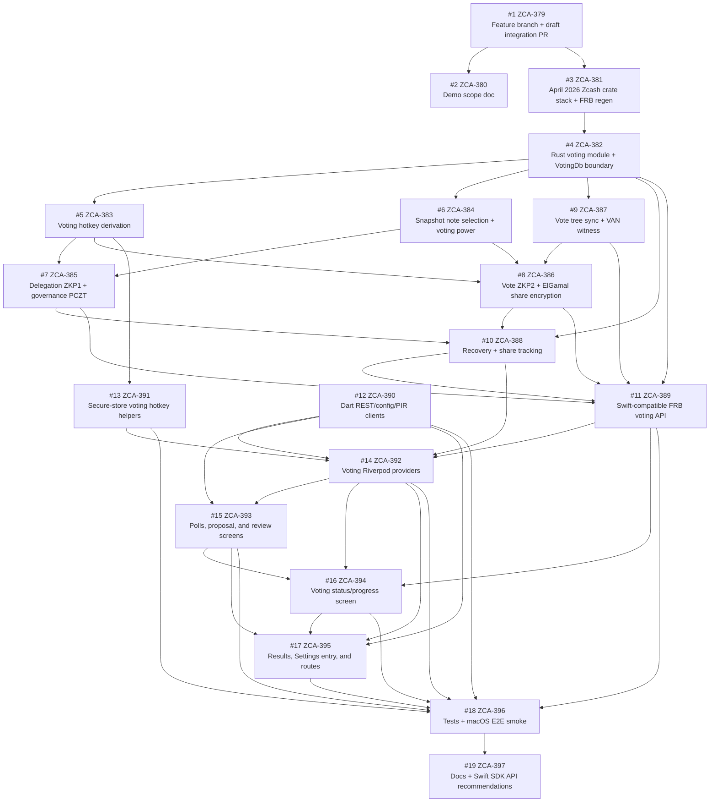

# Voting Demo Scope

This document captures the locked scope for the macOS-first coinholder polling
demo, the acceptance criteria, and the dependency graph for the feature branch.

## Target

The demo targets Vizor on macOS first. iOS support follows after the macOS flow is
working end to end; iOS background tasks, Live Activities, and platform-specific
polish are intentionally outside this milestone.

The account scope is software accounts only. Keystone and other hardware-wallet
entry points should stay hidden or present a "Keystone support coming soon" hint.

## Happy Path

The demo proves the full software-account voting path:

1. Load voting configuration from `voting.valargroup.org` and list active rounds.
2. Apply endorser filtering so endorsed rounds are highlighted and endorser
   failures soft-fail to an unendorsed/empty state.
3. Initialize round-local state for the active software account.
4. Generate the delegation proof (ZKP1), construct the governance PCZT, sign it
   locally from the software seed, and broadcast it.
5. Generate the vote proof (ZKP2), encrypt ElGamal shares for the round's share
   servers, and submit to all required N servers.
6. Persist enough recovery state to resume safely across app restarts, including
   mid-flow crashes.
7. Show results/tally state after submission.

## Compatibility

Keep compatibility with
[zcash-swift-wallet-sdk PR #1715](https://github.com/zcash/zcash-swift-wallet-sdk/pull/1715)
and [zodl-ios PR #36](https://github.com/valargroup/zodl-ios/pull/36) where the
integration boundary is shared:

- vote-sdk REST endpoints live under `/shielded-vote/v1/*`.
- Voting configuration is loaded from `voting.valargroup.org/voting-config.json`,
  with optional checksum pinning and a bundled app fallback.
- The endorsed-set endpoint is a soft-fail dependency.
- Voting network IDs remain `0 = test` and `1 = main`.
- Local workflow state is owned by `zcash_voting::storage::VotingDb`, with
  Swift-compatible round, bundle, recovery, and share-tracking semantics.
- `bundle_index` remains the durable key for delegation, PCZT/PIR, VAN, vote
  records, tx hashes, and recovery.
- Rich persisted/submitted payloads preserve the Swift SDK `VotingTypes.swift`
  JSON field names where they cross app or service boundaries.
- PIR endpoint selection fails closed unless the server's `/root.height`
  exactly matches the round snapshot height. `/root.network_id` and
  `/root.round_id` are optional diagnostics, not trusted endpoint identity.
- ElGamal share-encryption wire format remains compatible.

Intentional Vizor divergences:

- The Rust FFI surface is FRB-typed in `rust/src/api/voting.rs`, not Swift's
  hand-written `extern "C"` wrapper, but it preserves the same backend operation
  groups and durable state semantics.
- REST and endorser HTTP live in Dart. Rust owns crypto, wallet-DB queries, and
  the Rust-native commitment-tree HTTP from `zcash_voting`'s
  `client-tree-sync` feature.

## Out Of Scope

- Keystone voting support.
- iOS background-task handoff for voting work.
- Live Activities for voting progress.
- Pixel-faithful ZODL UI porting; use minimal Vizor-styled screens instead.
- Custom-chain manager work.

## Demo Success Criteria

On a fresh macOS install of Vizor with a software account on
`voting.valargroup.org`'s active round, complete the full delegate -> vote ->
submit flow and observe an updated tally on the results screen, then kill the app
mid-flow and confirm recovery on relaunch.

The final integration PR body should mention this doc and include the manual
smoke result for the success criteria above.

## Dependency Graph

