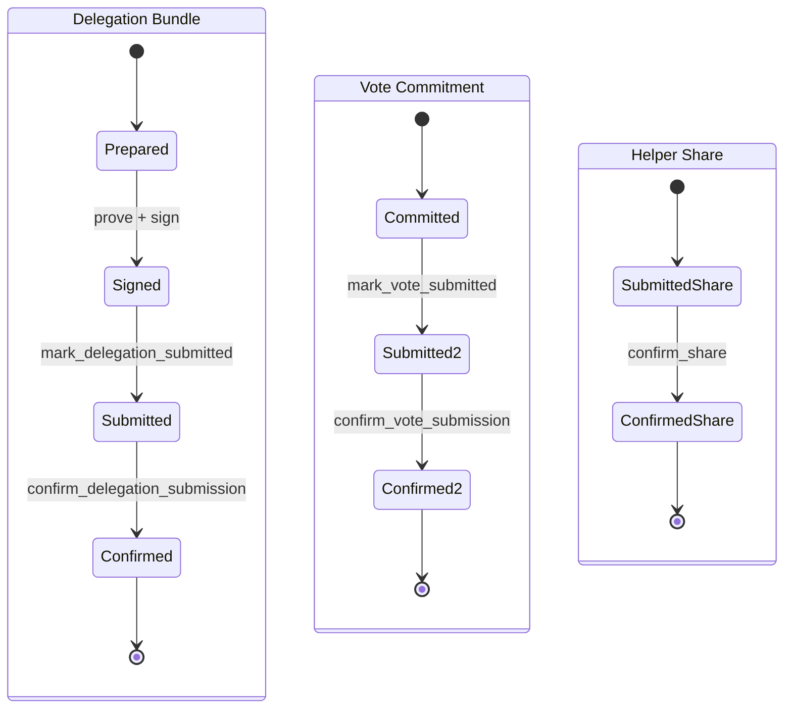

# Vizor Voting Integration (Rust)

This module integrates the [`zcash_voting`](https://github.com/valargroup/zcash_voting)
crate into Vizor. It owns the wallet-side concerns the crate intentionally leaves
to the host app: seed handling and hotkey derivation, the voting sidecar
database, delegation signing, and the Flutter Rust Bridge (FRB) surface that
exposes the crate lifecycle to Dart.

`zcash_voting` owns the protocol and the durable recovery state machine. Vizor
adds no parallel workflow tables. All phases and recovery are derived from the
crate's own `bundles`, `votes`, and `share_delegations` rows. For the canonical
setup -> precompute -> delegate -> vote -> share lifecycle, the per-bundle phase
definitions, and the restart planner, see the crate docs:

- Crate README: [`zcash_voting/zcash_voting/README.md`](https://github.com/valargroup/zcash_voting/blob/main/zcash_voting/README.md)
- Reference usage: [`wallet-example/src`](https://github.com/valargroup/zcash_voting/tree/main/wallet-example/src)
  (`example_delegation.rs`, `example_vote.rs`, `example_recovery.rs`)

This document focuses on what Vizor's integration is responsible for.

## Module Map

| File | Responsibility |
| --- | --- |
| `db.rs` | Opens the voting sidecar DB via `VotingDb::open_wallet_sidecar` at the deterministic path next to the wallet DB. The voting schema is isolated from the wallet `user_version`. |
| `network.rs` | Converts between wallet-layer network enums and `zcash_voting::Network` so wallet modules do not depend on API-layer helpers. |
| `hotkey.rs` | Derives scoped, opaque voting hotkey seed material from the wallet seed for software accounts. The derived secret is never persisted by Rust. |
| `delegation.rs` | Prepares, proves, and signs delegation bundles (software and Keystone paths), forwarding `DelegationProgress` to callers. Wallet seed signing stays here. |
| `../../api/voting.rs` | FRB boundary. Thin wrappers that open the sidecar DB and call crate lifecycle APIs (`delegate::*`, `vote::*`, `share::*`, `confirmation::*`, `session::*`, `precompute::*`). |
| `../../api/voting_helpers.rs` | API-only helper glue for delegation input resolution and bundle-parameter construction used by the FRB boundary. |

## Account Invariants And Secret Boundaries

Coinholder voting uses a crate-owned voting hotkey for delegation outputs and
vote signing.

- Software accounts derive the hotkey seed from the active account seed, round,
  and network via `hotkey::derive_hotkey`, then hand it to
  `zcash_voting::hotkey::voting_hotkey_from_seed`. The same tuple always yields
  the same material; changing any member produces independent material.
- Hardware accounts generate and store a random per-round hotkey seed because
  the wallet seed is not available to the host app.
- Locked wallets and software accounts without a stored mnemonic must fail
  before any proof or recovery work starts.

The wallet seed never leaves the wallet boundary. Delegation signing in
`delegation.rs::sign_delegation_request` consumes a crate-provided
`DelegationSigningRequest`, verifies the seed fingerprint, derives the account
SpendAuth key, randomizes it with `alpha`, and returns only the detached
signature plus sighash. The crate never receives root seed material.

### Session Pinning

A `votingSessionProvider(roundId)` instance is pinned to the active account UUID
captured when the session is built. All later context reloads, recovery reads,
delegation setup, vote-tree sync, vote submission, and share recovery must
continue to use that session account, even if the user switches accounts while
the round screen is open. Do not re-read the active account inside individual
session actions except through the session-pinned account helper.

## Durable vs Process-Local State

Two kinds of state exist, and they are both account scoped:

- **Durable** state lives in the `zcash_voting` sidecar tables (delegation
  bundles, signed artifacts, transaction hashes, VAN/VC positions, share
  submission history). This is the recovery source of truth.
- **Process-local** state is Rust memory and cached clients owned by the current
  app process, including the crate-owned vote-tree client.

Any durable key or process-local cache that touches prepared PCZTs, vote-tree
sync state, hotkeys, recovery rows, or share-delegation history must include the
wallet DB path plus the session account UUID where applicable.

### Reset Semantics

`reset_voting_session_state(db_path, account_uuid, round_id)` clears only
process-local state. It does not delete durable recovery rows, signed artifacts,
transaction hashes, or share history, and it does not abort in-flight proof or
vote jobs already running on worker threads.

- A non-empty `round_id` clears round-scoped caches only.
- `None` or an empty `round_id` is an account-wide reset and additionally drops
  the cached vote-tree client by calling
  `zcash_voting::precompute::reset_vote_tree`.

Vote-tree sync and reset are owned by the crate
(`zcash_voting::precompute::{sync_vote_tree, reset_vote_tree}`); Vizor does not
maintain its own tree-sync registry. The tree client is account/DB scoped, not
round scoped, so a round-scoped reset must not drop it.

Account-wide reset runs when switching away from the active account, removing an
account, resetting the wallet, or locking/signing out. These lifecycle
boundaries invalidate the owner of the process-local tree client but never
delete durable `zcash_voting` recovery rows.

## Lifecycle And Recovery

Vizor calls the crate's stage-oriented APIs rather than writing storage rows
directly. The mapping from FRB functions to crate APIs:

| Stage | FRB entry (`api/voting.rs`) | Crate API |
| --- | --- | --- |
| Bundle setup | `setup_delegation_bundles` | `delegate::ensure_round_context`, `VotingDb::ensure_bundles_with_skipped_suffix_with_policy` |
| Delegation prove/sign | `build_prove_and_sign_delegation_payload_with_progress`, Keystone variant | `delegate::{prepare_delegation_bundle, setup, prove, signing_request, signed_bundle, keystone_request}` |
| Delegation submit/confirm | `mark_delegation_submitted`, `confirm_delegation_submission` | `VotingDb::mark_delegation_submitted`, `confirmation::confirm_delegation_submission` |
| Vote commit | `build_vote_commitments_with_progress`, `recover_vote_commitment` | `vote::commit_batch`, `vote::recover_signed_commitments` |
| Vote submit/confirm | `mark_vote_submitted`, `confirm_vote_submission` | `VotingDb::mark_vote_submitted`, `confirmation::confirm_vote_submission` |
| Share submit/confirm | `record_share_delegation`, `mark_share_confirmed`, `add_sent_servers` | `vote::CommittedVote::{record_share, confirm_share}`, `share::add_sent_servers` |
| Ballot intent / restart | `set_ballot_intent`, `get_round_plan`, `get_round_recovery_state` | `VotingDb::set_ballot_intent`, `session::resume_plan`, `recovery::round_snapshot` |

The `confirmation::*` APIs parse chain `tx` events and atomically record tx
hashes, VAN positions, and VC positions. Restart recovery is driven by
`session::resume_plan`, which returns the ordered remaining `NextStep`s and the
proposals still open. Vizor's Dart recovery code consumes the crate's phase
strings; it does not derive its own phases.



### Helper Share Scheduling

Helper-share `submit_at` (the Unix-second reveal time sent to the helper server)
is computed in Dart from round timing before calling `record_share_delegation`:

- The last-moment buffer is 40% of the round duration from `ceremony_phase_start`
  to `vote_end_time`, capped at six hours.
- Before that buffer, each share samples a randomized `submit_at` uniformly in
  `[now, vote_end_time - buffer)`.
- Inside the buffer, the vote commitment uses single-share mode and shares use
  `submit_at = 0` (immediate submission).
- If round timing is missing or invalid, Vizor uses `submit_at = 0`.

Retry/resubmission paths submit immediately (`submit_at = 0`); the original
scheduled value remains part of the durable record for the first accepted
submission. The canonical scheduling/retry/polling policy lives in the crate's
`share_policy` module; Dart mirrors it via the `plan_share_submissions`,
`share_tracking_flags`, and `next_share_tracking_delay_seconds` helpers exposed
through `api/voting.rs`.

## Wire Types And FRB Scanning

`zcash_voting::wire` is the canonical owner of protocol wire JSON and wallet view
DTOs (field names, `serde` renames, base64/hex shaping, JSON-safe integer
bounds), for example `DelegationSubmissionWire`, `VoteCommitmentWire`,
`VanWitness`, `DraftVote`, `SignedVoteCommitmentsView`, and `RoundPlanView`. See
`zcash_voting::wire` for the full set.

Vizor keeps no FRB-local `Api*Wire` mirrors for these types. FRB codegen scans
the shared crate module directly via `flutter_rust_bridge.yaml`:

```yaml
rust_input: crate::api,zcash_voting::wire
```

That scan emits Dart value classes under
`lib/src/rust/third_party/zcash_voting/wire.dart` and generates the
`SseEncode` / `SseDecode` glue in Vizor's bridge code. The `zcash_voting` crate
stays framework-agnostic and does not depend on FRB.

FRB third-party scanning expects a struct-only module surface, so the DTO structs
stay in `zcash_voting::wire` while serialization helpers and conversions that
pull richer crate internals (`VotingError`, payload transforms) live in
`zcash_voting::wire_codec`. Call sites import canonical structs from
`zcash_voting::wire::*`.
