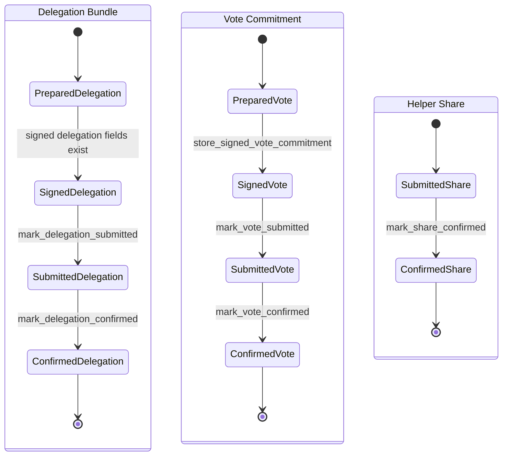

# Voting Recovery State Machine

This module keeps `zcash_voting` storage as the durable source of truth. Vizor
does not add parallel workflow tables. Instead, recovery phases are derived from
the existing `bundles`, `votes`, and `share_delegations` rows.

The state machine is artifact-scoped. Delegation bundles, vote commitments, and
helper-server share delegations each move through their own lifecycle. The shared
phase names are exposed through Rust recovery APIs as strings for Dart resume
logic.

## State Diagram



## Phase Definitions

### Delegation Bundle

Key: `(round_id, bundle_index)`

| Phase | Derived From | Resume Behavior |
| --- | --- | --- |
| `prepared` | `bundles` row exists with no `delegation_tx_hash` and no `van_leaf_position` | Build/prove and submit delegation. |
| `signed` | signed delegation fields exist in `bundles`, but no `delegation_tx_hash` | Submit delegation transaction. |
| `submitted_delegation` | `delegation_tx_hash` exists, but `van_leaf_position` is absent | Poll transaction confirmation and store VAN position. Do not resubmit. |
| `confirmed` | both `delegation_tx_hash` and `van_leaf_position` exist | No delegation recovery work remains. |

### Vote Commitment

Key: `(round_id, bundle_index, proposal_id)`

| Phase | Derived From | Resume Behavior |
| --- | --- | --- |
| `prepared` | `votes` row exists without `tx_hash` or commitment recovery data | Build and sign vote commitment. |
| `signed` | `commitment_bundle_json` exists without submitted vote transaction state | Submit cast-vote transaction. |
| `submitted_vote` | `tx_hash` exists and `submitted = 1`, but confirmation data is incomplete | Poll transaction confirmation and store vote confirmation data. Do not resubmit. |
| `confirmed` | `tx_hash`, `submitted = 1`, `vc_tree_position`, and `commitment_bundle_json` exist | No vote recovery work remains. |

### Helper Share Delegation

Key: `(round_id, bundle_index, proposal_id, share_index)`

| Phase | Derived From | Resume Behavior |
| --- | --- | --- |
| `submitted_share` | `share_delegations` row exists with `confirmed = false` | Retry/poll helper confirmation using stored sent-server history. |
| `confirmed` | `share_delegations.confirmed = true` | No share recovery work remains. |

## Transition Points

### Bundle Setup And Reuse

`delegation::ensure_bundles` owns initial bundle setup through
`VotingDb::setup_bundles`. If bundle rows already exist, it validates the
current note selection using `zcash_voting::storage::queries::require_bundle_notes`
before any PIR or proof work. A reused bundle must have the same note identity
and shape as the current selected notes.

Transition:

```text
no bundle rows --setup_bundles--> prepared
existing bundle rows --require_bundle_notes ok--> prepared/signed/submitted/confirmed as derived
existing bundle rows --note mismatch--> error
```

### Delegation Submission

`workflow::mark_delegation_submitted` is the only transition for recording a
delegation transaction hash. It starts a SQLite transaction, checks any existing
hash for same-data idempotency, stores `bundles.delegation_tx_hash`, and commits.

Transition:

```text
signed --store delegation_tx_hash--> submitted_delegation
submitted_delegation --same tx_hash--> submitted_delegation
submitted_delegation --different tx_hash--> error
```

### Delegation Confirmation

`workflow::mark_delegation_confirmed` atomically stores both
`bundles.delegation_tx_hash` and `bundles.van_leaf_position`. It accepts repeated
calls with the same tx hash and VAN position, but rejects conflicting data.

Transition:

```text
submitted_delegation --store van_leaf_position--> confirmed
confirmed --same tx_hash and same van_leaf_position--> confirmed
confirmed --conflicting tx_hash or van_leaf_position--> error
```

### Vote Signing Recovery

`vote::build_vote_commitments` builds the vote commitment, share payloads, and
signature first. Only after `sign_cast_vote` succeeds does it call
`workflow::store_signed_vote_commitment`.

`workflow::store_signed_vote_commitment` opens a transaction, checks existing
`commitment_bundle_json` and `vc_tree_position` for same-data idempotency, stores
the commitment recovery fields through `zcash_voting` queries, and commits.

This ordering prevents recovery from seeing a commitment bundle that was built
but never successfully signed.

Transition:

```text
prepared --sign_cast_vote ok + store commitment recovery--> signed
signed --same commitment_json and vc_tree_position--> signed
signed --conflicting commitment_json or vc_tree_position--> error
sign_cast_vote error --> prepared
```

### Vote Submission

`workflow::mark_vote_submitted` is the only transition for recording cast-vote
submission. It stores `votes.tx_hash` and marks `votes.submitted = 1` in one
SQLite transaction.

Transition:

```text
signed --store tx_hash + submitted=1--> submitted_vote
submitted_vote --same tx_hash--> submitted_vote
submitted_vote --different tx_hash--> error
```

### Vote Confirmation

`workflow::mark_vote_confirmed` atomically stores:

- `votes.tx_hash`
- `votes.submitted = 1`
- `bundles.van_leaf_position`
- `votes.commitment_bundle_json`
- `votes.vc_tree_position`

It is idempotent for repeated same-data confirmation and rejects conflicts.

Transition:

```text
submitted_vote --store confirmation fields--> confirmed
confirmed --same tx_hash, positions, and commitment JSON--> confirmed
confirmed --conflicting tx_hash, position, or commitment JSON--> error
```

### Share Submission

`workflow::record_share_delegation` records helper-server share submission in
`share_delegations`. It wraps the upstream write in a SQLite transaction and
checks that a repeated share key does not change the share nullifier.

Transition:

```text
no share row --record share_delegation--> submitted_share
submitted_share --same nullifier and updated sent_to_urls--> submitted_share
submitted_share --different nullifier--> error
```

### Share Confirmation

`workflow::mark_share_confirmed` wraps the helper confirmation update in a SQLite
transaction and marks `share_delegations.confirmed = true`.

Transition:

```text
submitted_share --confirmed=true--> confirmed
confirmed --mark confirmed again--> confirmed
```

## Resume Rules

Dart recovery code consumes the derived phase strings via `VotingWorkflowPhase`
constants.

- `submitted_delegation` resumes by polling the delegation transaction and
  storing `van_leaf_position`.
- `submitted_vote` resumes by polling the cast-vote transaction and storing vote
  confirmation data.
- `submitted_share` resumes helper confirmation/retry using stored
  `sent_to_urls`.
- `confirmed` artifacts are omitted from pending work.

