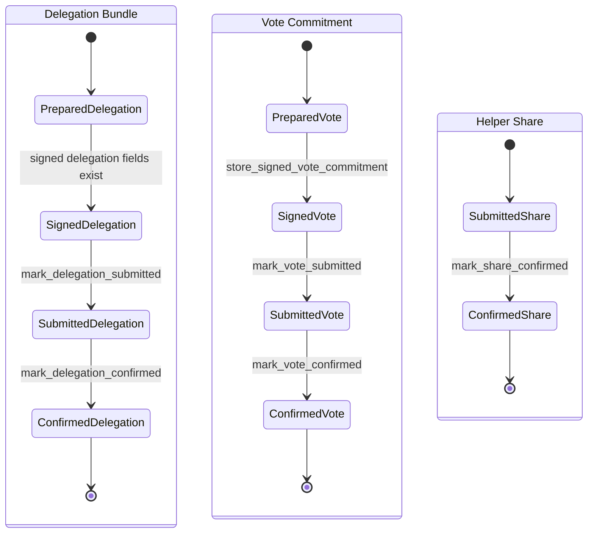

# Voting Recovery State Machine

This module keeps `zcash_voting` storage as the durable source of truth. Vizor
does not add parallel workflow tables. Instead, recovery phases are derived from
the existing `bundles`, `votes`, and `share_delegations` rows.

The state machine is artifact-scoped. Delegation bundles, vote commitments, and
helper-server share delegations each move through their own lifecycle. The shared
phase names are exposed through Rust recovery APIs as strings for Dart resume
logic.

## Account Invariants

Coinholder voting is software-account only. The delegation and vote flows need
the active account's mnemonic-derived seed to derive the voting hotkey and sign
the delegation payload. Hardware accounts, locked wallets, and accounts without
a stored mnemonic must fail before proof or recovery work starts, with a
user-facing message that voting requires a software account.

A `votingSessionProvider(roundId)` instance is pinned to the active account UUID
captured when the session is built. All later context reloads, recovery reads,
delegation setup, vote-tree sync, vote submission, share recovery, and
round-scoped cleanup must continue using that session account, even if the user
switches accounts while the round screen is open. Do not re-read the active
account inside individual session actions except through the session-pinned
account helper.

Durable voting state and process-local caches are account scoped. Any key or
cleanup path that touches prepared delegation PCZTs, vote-tree sync state,
hotkeys, recovery rows, or share-delegation history must include the wallet DB
path plus the session account UUID where applicable. Account-wide lifecycle
events such as account switch, account removal, wallet reset, or lock/sign-out
invalidate process-local state for the abandoned account; they do not delete
durable `zcash_voting` recovery rows.

## State Diagram



## Phase Definitions

### Delegation Bundle

Key: `(round_id, bundle_index)`

| Phase | Derived From | Resume Behavior |
| --- | --- | --- |
| `prepared` | `bundles` row exists with no `delegation_tx_hash` and no `van_leaf_position` | Build/prove and submit delegation. |
| `signed` | signed delegation fields exist in `bundles`, but no `delegation_tx_hash` | Submit delegation transaction. |
| `submitted_delegation` | `delegation_tx_hash` exists, but `van_leaf_position` is absent | Poll transaction confirmation and store VAN position. Do not resubmit. |
| `confirmed` | both `delegation_tx_hash` and `van_leaf_position` exist | No delegation recovery work remains. |

### Vote Commitment

Key: `(round_id, bundle_index, proposal_id)`

| Phase | Derived From | Resume Behavior |
| --- | --- | --- |
| `prepared` | `votes` row exists without `tx_hash` or commitment recovery data | Build and sign vote commitment. |
| `signed` | `commitment_bundle_json` exists without submitted vote transaction state | Submit cast-vote transaction. |
| `submitted_vote` | `tx_hash` exists and `submitted = 1`, but confirmation data is incomplete | Poll transaction confirmation and store vote confirmation data. Do not resubmit. |
| `confirmed` | `tx_hash`, `submitted = 1`, `vc_tree_position`, and `commitment_bundle_json` exist | No vote recovery work remains. |

### Helper Share Delegation

Key: `(round_id, bundle_index, proposal_id, share_index)`

| Phase | Derived From | Resume Behavior |
| --- | --- | --- |
| `submitted_share` | `share_delegations` row exists with `confirmed = false` | Retry/poll helper confirmation using stored sent-server history. |
| `confirmed` | `share_delegations.confirmed = true` | No share recovery work remains. |

## Transition Points

### Bundle Setup And Reuse

`VotingDb::ensure_bundles_for_notes` owns initial bundle setup through
`VotingDb::setup_bundles`. If bundle rows already exist, it validates the
current note selection using `zcash_voting::storage::queries::require_bundle_notes`
before any PIR or proof work. A reused bundle must have the same note identity
and shape as the current selected notes.

Transition:

```text
no bundle rows --setup_bundles--> prepared
existing bundle rows --require_bundle_notes ok--> prepared/signed/submitted/confirmed as derived
existing bundle rows --note mismatch--> error
```

### Delegation Submission

`workflow::mark_delegation_submitted` is the only transition for recording a
delegation transaction hash. It starts a SQLite transaction, checks any existing
hash for same-data idempotency, stores `bundles.delegation_tx_hash`, and commits.

Transition:

```text
signed --store delegation_tx_hash--> submitted_delegation
submitted_delegation --same tx_hash--> submitted_delegation
submitted_delegation --different tx_hash--> error
```

### Delegation Confirmation

`workflow::mark_delegation_confirmed` atomically stores both
`bundles.delegation_tx_hash` and `bundles.van_leaf_position`. It accepts repeated
calls with the same tx hash and VAN position, but rejects conflicting data.

Transition:

```text
submitted_delegation --store van_leaf_position--> confirmed
confirmed --same tx_hash and same van_leaf_position--> confirmed
confirmed --conflicting tx_hash or van_leaf_position--> error
```

### Vote Signing Recovery

`vote::build_vote_commitments` builds the vote commitment, share payloads, and
signature first. Only after `sign_cast_vote` succeeds does it call
`workflow::store_signed_vote_commitment`.

`workflow::store_signed_vote_commitment` opens a transaction, checks existing
`commitment_bundle_json` and `vc_tree_position` for same-data idempotency, stores
the commitment recovery fields through `zcash_voting` queries, and commits.

This ordering prevents recovery from seeing a commitment bundle that was built
but never successfully signed.

Transition:

```text
prepared --sign_cast_vote ok + store commitment recovery--> signed
signed --same commitment_json and vc_tree_position--> signed
signed --conflicting commitment_json or vc_tree_position--> error
sign_cast_vote error --> prepared
```

### Vote Submission

`workflow::mark_vote_submitted` is the only transition for recording cast-vote
submission. It stores `votes.tx_hash` and marks `votes.submitted = 1` in one
SQLite transaction.

Transition:

```text
signed --store tx_hash + submitted=1--> submitted_vote
submitted_vote --same tx_hash--> submitted_vote
submitted_vote --different tx_hash--> error
```

### Vote Confirmation

`workflow::mark_vote_confirmed` atomically stores:

- `votes.tx_hash`
- `votes.submitted = 1`
- `bundles.van_leaf_position`
- `votes.commitment_bundle_json`
- `votes.vc_tree_position`

It is idempotent for repeated same-data confirmation and rejects conflicts.

Transition:

```text
submitted_vote --store confirmation fields--> confirmed
confirmed --same tx_hash, positions, and commitment JSON--> confirmed
confirmed --conflicting tx_hash, position, or commitment JSON--> error
```

### Share Submission

`workflow::record_share_delegation` records helper-server share submission in
`share_delegations`. It wraps the upstream write in a SQLite transaction and
checks that a repeated share key does not change the share nullifier. The
`submit_at` value stored with the row is the Unix-second reveal time sent to the
helper server for that encrypted share.

Dart computes `submit_at` from the round timing metadata before calling this
Rust transition:

- The last-moment buffer is `40%` of the round duration from
  `ceremony_phase_start` to `vote_end_time`, capped at six hours.
- Before that buffer starts, each share samples a randomized `submit_at`
  uniformly in `[now, vote_end_time - buffer)`.
- Inside the last-moment buffer, the vote commitment uses single-share mode and
  shares use `submit_at = 0`, meaning immediate helper submission.
- If round timing is missing or invalid, Vizor also uses `submit_at = 0` rather
  than guessing a schedule.

Recovery treats stored share rows as already accepted by at least one helper.
Retry/resubmission paths may submit immediately with `submit_at = 0`; the
original scheduled value remains part of the durable audit/recovery record for
the first accepted submission.

Dart mirrors the zodl iOS share tracker before calling the Rust transitions:
helper status checks wait until `submit_at + 10s` for delayed shares or
`created_at + 10s` for immediate shares, and missing-helper retries wait until
the share is overdue by `max(30s, min(1h, remaining_window / 4))`. Retry bodies
are immediate (`submit_at = 0`), but `record_share_delegation` keeps the
original scheduled value unless a new helper acceptance is appended through the
same durable share key.

Transition:

```text
no share row --record share_delegation--> submitted_share
submitted_share --same nullifier and updated sent_to_urls--> submitted_share
submitted_share --different nullifier--> error
```

### Share Confirmation

`workflow::mark_share_confirmed` wraps the helper confirmation update in a SQLite
transaction and marks `share_delegations.confirmed = true`.

Transition:

```text
submitted_share --confirmed=true--> confirmed
confirmed --mark confirmed again--> confirmed
```

## Process-Local Reset Behavior

Durable recovery state lives in `zcash_voting` tables. Resetting process-local
voting state must not delete recovery rows, signed artifacts, transaction hashes,
or share submission history. It only clears Rust memory owned by the current app
process.

### Prepared Delegation PCZT Cache

`delegation.rs` keeps prepared governance PCZTs in
`PREPARED_DELEGATION_PCZTS`. These entries are warm-up artifacts from
`precompute_delegation_pir`, keyed by:

```text
(db_path, account_uuid, round_id, bundle_index, branch_id, hotkey_raw_address)
```

They are intentionally short-lived because the values depend on a specific
round, bundle, consensus branch, and hotkey. The real delegation path consumes
an entry with `.remove()` before proving. A second use of the same prepared PCZT
requires another precompute.

Round-scoped cleanup calls `reset_voting_session_state` with a non-empty
`round_id`. This clears only prepared PCZTs for `(db_path, account_uuid,
round_id)` and advances that account's cache epoch. If a background precompute
finishes after the reset, the epoch check prevents it from reinserting stale
PCZT material.

Round-scoped cleanup runs when:

- a `votingSessionProvider(roundId)` instance is disposed
- a voting session action fails before completion
- delegation PIR precompute fails

### VoteTreeSync Registry

`tree_sync.rs` keeps `TREE_SYNC_REGISTRY`, keyed only by:

```text
(db_path, wallet_id)
```

`VoteTreeSync` is account/DB scoped, not round scoped. It may serve any voting
round for the same wallet, so round-scoped cleanup must not drop it. There is no
TTL eviction for this registry; clearing it on time alone would throw away useful
cross-round tree state.

Account-wide cleanup calls `reset_voting_session_state` with `round_id = None`
or an empty round ID. This clears all prepared PCZTs for `(db_path, wallet_id)`
and drops the cached `VoteTreeSync` for that wallet.

Account-wide cleanup runs when:

- switching away from the active account
- removing an account
- resetting the wallet
- locking/signing out of the wallet

The assumption is that account-wide lifecycle boundaries invalidate the owner of
the process-local tree client. Reusing `VoteTreeSync` across rounds is expected;
reusing it after the account, DB, or unlocked wallet session has been abandoned
is not.

## Resume Rules

Dart recovery code consumes the derived phase strings via `VotingWorkflowPhase`
constants.

- `submitted_delegation` resumes by polling the delegation transaction and
  storing `van_leaf_position`.
- `submitted_vote` resumes by polling the cast-vote transaction and storing vote
  confirmation data.
- `submitted_share` resumes helper confirmation/retry using stored
  `sent_to_urls`.
- `confirmed` artifacts are omitted from pending work.

